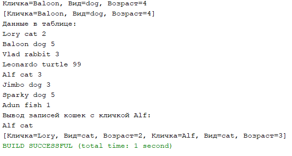

Скрипт для создания таблицы:
```
CREATE TABLE `animal` (
  `id` int NOT NULL AUTO_INCREMENT, 
  `NickName` varchar(50) NOT NULL,
  `AnimalKind` varchar(50) NOT NULL,
  `AnimalAge` int NOT NULL,
  PRIMARY KEY (`id`)
) ENGINE=InnoDB DEFAULT CHARSET=utf8;
```
